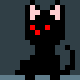

# Pixel Art to CSS - Redux Exercise
##### See the original app live at [pixelartcss](http://www.pixelartcss.com/)


This exercise will get you familiar with Redux actions, reducers composition and mapping state to views. All you should care about is the model and the state (you shouldn't worry about the view layer, it's already there). 
> Get comfortable with [javascript](https://developer.mozilla.org/en-US/docs/Web/JavaScript).

---


## Setup and run

Clone this repo, then install node packages and run:

```bash
git clone https://github.com/Ner1Co/pixel-art-react.git

cd pixel-art-react
npm install
npm run development
```

The app will run at  http://localhost:8080 with hot reloading.


 If you don't have npm installed:
```bash
brew install node
```
 
---
 
 ## Redux

Under `store` directory, you can find `actions.js` for [actions](http://redux.js.org/docs/basics/Actions.html#actions) constants, `actionCreators.js` for all the [action creators](http://redux.js.org/docs/basics/Actions.html#action-creators), `reducer.js` for all the [reducers](http://redux.js.org/docs/basics/Reducers.html) and `selectors.js` for state selectors.
Feel free to move or change everything as you like, you also can jump between different parts of the exercise.

All the React views are under the `components` directory.

Enjoy!

### Step 1: New Project

The app is loaded with a snapshot of initial state, we love cats - but we also want to start our own new draw.

There is an action called `NEW_PROJECT`, and `newProject` action creator:
  1.  In `NewProject.jsx` component file, map the dispatching `NEW_PROJECT` action to the button click event.
      The function `mapDispatchToProps` must return an object with a `onClick` key (the component input), and a value that is a function with no parameters that dispatch your action.

    { onClick: () => dispatch(yourActionObject) }
     
 Now, on every `New` button click, an action is dispatched to the reducer. You can see all the logged actions in the browser console or with [redux-dev-tools extension](https://chrome.google.com/webstore/detail/redux-devtools/lmhkpmbekcpmknklioeibfkpmmfibljd).
  
2.  Handle `NEW_PROJECT` action in your root reducer and return a new state. You can use the helper function `newProject` for getting a new state with default values.

> Suggested  [solution](https://github.com/Ner1Co/pixel-art-react/commit/ac7303916874258460e337628e7c023b3de93a90).

---
  
### Step 2: Draw

Clicking on the grid is already mapped to an action creator called `cellClicked` in the `PixelCanvas.jsx` component.
  1. Create a corresponding action and handle this action in the reducer. Return new state when the clicked cell in the active frame is filled with color.
    **Remember**: The state is immutable, use [spread operator](https://developer.mozilla.org/he/docs/Web/JavaScript/Reference/Operators/Spread_operator), and [map](https://developer.mozilla.org/en-US/docs/Web/JavaScript/Reference/Global_Objects/Array/map?v=control).
  2. Use [reducers composition](http://redux.js.org/docs/basics/Reducers.html#splitting-reducers) in order to handle the `frames` piece of state separately.
   
  > **Note:**  Copying the frame grid on each draw, may not the best solution -  it's only for simplicity.
  
  > Read more about [Persistent data structures](https://en.wikipedia.org/wiki/Persistent_data_structure) and [Immutable.js](https://facebook.github.io/immutable-js/) and [Performance](http://redux.js.org/docs/faq/Performance.html).
  


>  Suggested [solution](https://github.com/Ner1Co/pixel-art-react/commit/08c5390099e4950e2a555c5a6ff1392bbd931945).

---

### Step 3: Frames
  This step is a good example of how [different reducers](http://redux.js.org/docs/faq/Reducers.html#reducers-share-state) can handle the same action.

  1. Create `changeActiveFrame` and `createNewFrame` action creators and corresponding actions, then handle the actions in your `frames` and `activeFrameIndex` reducers. The action creators are already connected to the `FrameHandler.jsx` component. Use the helper functions from `/utils/frame.js`.

  2. (**Extra**) Do the same for `deleteFrame`, `duplicateFrame`, `changeFrameInterval`, `changeDimensions` and `resetGrid` action creators.
  
  > **Note:** In this stage the reducer file become larger and you are encouraged to read [this](http://redux.js.org/docs/faq/CodeStructure.html), and refactor your code shape.
  **Remember:** action creators and reducers are just functions, you can do any change that suits your case.
  
 Congratulations! if you have finished this part, you can create an animation from multiple frames.

> Suggested  [solution](https://github.com/Ner1Co/pixel-art-react/commit/0fedd6f477bdc1f8e539c1f1b402b7301d981d7f) and [extra](https://github.com/Ner1Co/pixel-art-react/commit/4d7ec136dcc25f1afdfc5ae50768fc996a1c0710).

---

### Step 4: (Extra) Color and Tools
 
  Add functionality for color selection, tools selection, erasing and color picking.
  
> Suggested  [solution](https://github.com/Ner1Co/pixel-art-react/commit/6e67ef2eebf3ee5a8d61b5c28ce501d42d7a52aa).

---
 
## Testing

Reducers and action creators are [easy to test](http://redux.js.org/docs/recipes/WritingTests.html#reducers), feel free to write your own tests under `test` directory. Make sure your file have `_spec` suffix, and run:

```bash
npm run test
```

## License

[MIT](https://opensource.org/licenses/mit-license.php)
Copyright © 2016 Javier Valencia Romero (@jvalen)


